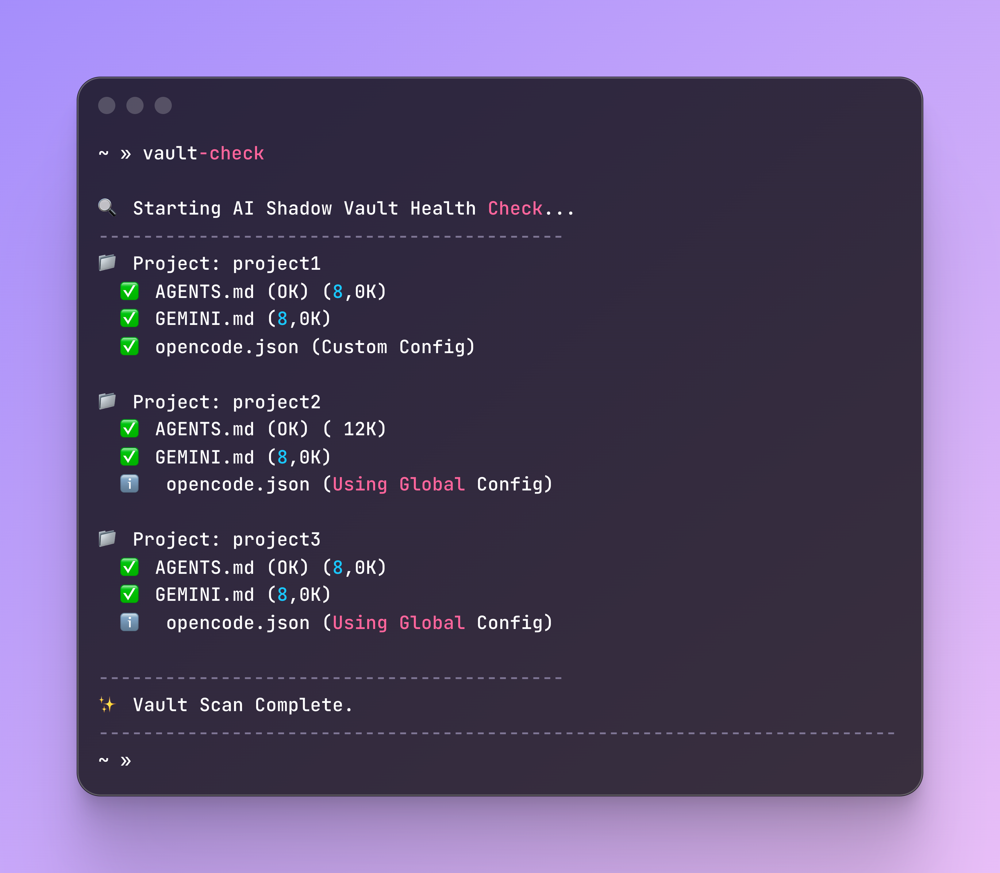

# AI Shadow Vault 🛡️

**AI Shadow Vault: A local DX infrastructure for context-aware AI coding. It uses ZSH-automated symlinks to inject private context and rules from a secure vault into your workflow. Eliminate git pollution and privacy leaks while optimizing AI performance and costs. The elite setup for professional, private, and efficient AI-driven development.**

---

## 🚀 The Concept
This project solves the "Context Dilemma": How to give AI deep project knowledge without committing sensitive `.md` files to your team's repository or polluting your `.gitignore`.

By using a decentralized **Vault** in your `$HOME` directory and ZSH hooks, this tool automatically injects context via symbolic links whenever you enter a project folder.

## 🛠️ Installation

1. **Clone & Setup:**
   ```bash
   git clone https://github.com/diogocnunes/ai-shadow-vault.git ~/.ai-shadow-vault
   mkdir -p ~/.gemini-vault
   ```
2. **ZSH Integration:** Add this to your `~/.zshrc`:
    ```bash
    source ~/.ai-shadow-vault/scripts/shell_integration.zsh
    ```
3. **Initialize a Project:**
    ```bash
    cd your-project-folder
    ~/.ai-shadow-vault/bin/vault-init.sh
    ```
## 📋 Customization & Stack Agnostic

The provided templates in `templates/AGENTS.md` and `templates/GEMINI.md` are pre-configured for a modern **Laravel 11 / PHP 8.3 / Nova 4** stack.

**However, these are just samples.** You can (and should) modify them freely to match your specific stack (Node.js, Python, Go, React, etc.). The AI will follow whatever rules you define in your local Vault.

## 🛡️ Safety First: Global Git Protection
The `vault-init.sh` script automatically configures a global git exclusion ruleset. It creates or updates your `~/.gitignore_global` to include:
- `GEMINI.md`
- `AGENTS.md`
- `.opencode.json`

This ensures that even if a symlink is created locally, it will **never** be detected or committed by Git, keeping your AI instructions private and your repository clean.

## 🤖 AI & LLM Compatibility

This system was built and extensively tested using **Google Gemini** (via OpenCode and gemini-cli).

* **Open to Contributions:** If you implement this workflow with other LLMs (OpenAI, Anthropic, etc.) and discover specific optimizations or configuration tweaks, feel free to open a PR and share your findings!

## 💰 Cost Optimization (Gemini Flash + Paid Tier)

To maximize performance while keeping costs near zero, this setup prioritizes the **Gemini Flash** model for operational tasks (Build/Plan) and reserves **Gemini Pro** for complex architectural decisions.

### How to configure "Safety Brakes":

1. **Enable Paid Tier (Level 1):** Go to [Google AI Studio](https://aistudio.google.com/) and switch your plan to **Pay-as-you-go**. This removes the "Free Tier" rate limits (20 requests/min), enabling smooth `/init` commands without interruptions.

2. **Set Hard Quotas (The "Kill Switch"):** In the [Google Cloud Console](https://console.cloud.google.com/apis/api/generativelanguage.googleapis.com/quotas), edit your **"Paid Tier"** quotas to prevent unexpected costs:
    - **Gemini Flash:** Set to **500** requests per day.
    - **Gemini Pro:** Set to **200** requests per day.
    - These limits ensure that even in a "loop" scenario, you won't spend more than a few cents per day.

3. **Budget Alerts:** Set a monthly budget alert of **$5.00** in Google Cloud Billing to receive immediate email notifications of any spending.

## 📊 Monitoring
Run `vault-check` at any time to verify the integrity of your symlinks and the size of your context files. This tool ensures your "Shadow Context" is always active and properly linked.

### Example Output:


## 💻 System Compatibility
- **macOS:** Native support (Tested on macOS Sequoia/Sonoma with ZSH).
- **Linux:** Fully supported (Ubuntu, Fedora, etc. - requires ZSH).
- **Windows:** Supported via **WSL2** (Windows Subsystem for Linux). Native PowerShell/CMD execution is not recommended due to symbolic link permission restrictions.


## ⚖️ License
MIT