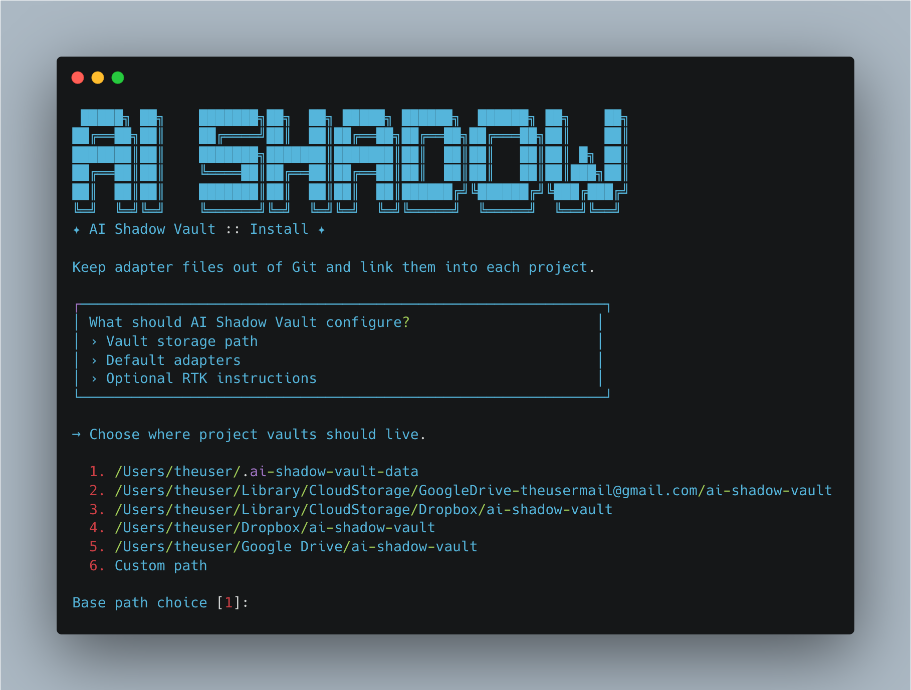

# AI Shadow Vault

Mantém os ficheiros de adapter de IA fora do Git.

O AI Shadow Vault é uma ferramenta shell-first para equipas e developers que querem `CLAUDE.md`, `AGENTS.md` e `GEMINI.md` disponíveis dentro de cada projeto sem transformar esses ficheiros em ruído no repositório.

Entrega:
- uma CLI limpa com `ai-vault`
- um instalador inicial com identidade visual
- adapters guardados fora do repositório
- identidade estável entre worktrees Git
- pastas `.ai/docs` e `.ai/plans` ligadas por symlink
- exclusões Git locais sem tocar no `.gitignore`

Não tenta ser um sistema de memória, runtime de skills, gestor de tarefas ou framework de agentes.

## Preview



## Porque Existe

Muita gente quer instruções para IA perto do código, mas não quer commitar esses ficheiros em todos os projetos.

O AI Shadow Vault resolve isso ao guardar os adapters num vault da máquina e ligá-los ao projeto apenas quando necessário.

Resultado:
- o repositório fica limpo
- os adapters ficam reutilizáveis
- a configuração mantém-se determinística
- as worktrees partilham a mesma identidade de vault

## Instalação

O Homebrew é o canal principal.

```bash
brew tap <your-tap>
brew install ai-vault
ai-vault
```

## Primeira Execução

Corre:

```bash
ai-vault
```

Na primeira execução, o AI Shadow Vault abre um setup curto e interativo onde escolhes:
- caminho base do vault
- adapters por defeito
- toggle de instruções RTK

A config global fica em:

```text
$XDG_CONFIG_HOME/ai-shadow-vault/config.json
```

Fallback:

```text
~/.config/ai-shadow-vault/config.json
```

O caminho base sugerido por defeito é:

```text
~/.ai-shadow-vault-data
```

Se existirem pastas sincronizadas compatíveis, também aparecem como opção.

## Comandos Principais

```bash
ai-vault install
ai-vault init
ai-vault update
```

### `ai-vault install`

Corre o wizard inicial ou atualiza a config global da máquina.

### `ai-vault init`

Liga o projeto atual ao vault configurado.

Ele:
- resolve a raiz do projeto
- deriva uma identidade estável partilhada entre worktrees Git
- gera os adapters selecionados
- liga `.ai/docs` e `.ai/plans`
- repara symlinks quando necessário
- migra diretórios `.ai/docs` ou `.ai/plans` com confirmação
- atualiza `.git/info/exclude` de forma idempotente

### `ai-vault update`

O comportamento depende da forma de instalação:
- instalação Homebrew: informa para correr `brew upgrade ai-vault`
- instalação source/git: atualiza o checkout a partir de `origin/main`
- instalação empacotada sem git: informa para reinstalar a release mais recente

## O Que É Criado

Layout do vault externo:

```text
<vault_base_path>/<project-slug>-<hash>/
  AGENTS.md
  CLAUDE.md
  GEMINI.md
  docs/
    index.md
    core/
      autoload-policy.md
      quick-start.md
      common-mistakes.md
      architecture-map.md
    learnings/
      generic/
      laravel/
      node/
  plans/
```

Layout dentro do projeto:

```text
.ai/
  docs -> external/docs
  plans -> external/plans

AGENTS.md -> external/AGENTS.md
CLAUDE.md -> external/CLAUDE.md
GEMINI.md -> external/GEMINI.md
```

Só os adapters ativos na config global são gerados e ligados.
O `AGENTS.md` é gerado como entrypoint canónico; `CLAUDE.md` e `GEMINI.md` ficam como adapters finos por provider.

## Identidade Estável do Projeto

Os caminhos do vault são estáveis entre worktrees Git.

Raiz de identidade:
- projeto Git: raiz comum do repositório
- projeto sem Git: `realpath(project root)`

Hash:
- `sha1(realpath(identity-root))`
- primeiros 8 caracteres hexadecimais

Formato final:

```text
<slug>-<hash>
```

## Geração dos Adapters

Adapters suportados:
- `CLAUDE.md`
- `AGENTS.md`
- `GEMINI.md`

Todos os adapters são renderizados a partir do mesmo modelo interno de instruções para manter tudo alinhado e sem drift.

Factos do repositório que podem alterar o output:
- versão de PHP em `composer.json`
- framework backend em `composer.json`
- Laravel Nova em `composer.json`
- Filament em `composer.json`
- Vue em `package.json`
- Quasar em `package.json`
- PrimeVue em `package.json`
- Pest em `composer.json`
- Playwright em `package.json`
- RTK disponível via `command -v rtk`

As instruções RTK só entram quando:
- o RTK está disponível naquele ambiente
- a config global tem RTK ativo

O output gerado pode incluir uma secção curta `Stack Snapshot` (quando detetável), derivada dos manifests do repositório.
Mantém-se factual e leve, e serve para orientar a seleção on-demand de learnings por stack.

Exemplo:

```md
## Stack Snapshot

Short, factual context derived from repository manifests.

### Backend

- PHP ^8.4
- Laravel ^12.0
- Filament ^4.0

### Frontend / UI

- Vue ^3.5
- PrimeVue ^4.3

### Testing

- Pest ^3.8
```

## Estratégia de Git

O AI Shadow Vault gere apenas `.git/info/exclude`.

Exemplo do bloco gerido:

```text
# >>> ai-shadow-vault >>>
/.ai/
/CLAUDE.md
/AGENTS.md
/GEMINI.md
# <<< ai-shadow-vault <<<
```

O bloco é gerado a partir dos adapters ativos.

`.gitignore` nunca é modificado.

## Migração e Reparação

Para `.ai/docs` e `.ai/plans`:
- diretórios reais são tratados como conteúdo do utilizador
- a migração pede confirmação
- conflitos de ficheiros são preservados com:

```text
name.migrated-YYYYMMDD-HHMMSS.ext
```

Para ficheiros de adapter na raiz do projeto:
- symlink em falta: criar
- symlink correto: no-op
- symlink errado: propor reparação
- ficheiro real: mostrar diff e pedir confirmação antes de substituir

Se mais tarde desativares um adapter na config, o `ai-vault init` deteta o symlink antigo, mostra a remoção e atualiza o `.git/info/exclude`.

## Idempotência

Execuções repetidas de `ai-vault init` não devem gerar alterações quando o projeto já está no estado correto.

Isso inclui:
- sem symlinks duplicados
- sem entradas duplicadas no exclude
- sem reescritas desnecessárias
- sem repetir migrações

## Vault em Pastas Sincronizadas

O caminho base do vault pode viver em:
- Google Drive
- Dropbox
- outra pasta sincronizada
- qualquer diretório local que escolhas

Essa decisão é configuração da máquina, não do projeto.

## Homebrew e Packaging

O repositório inclui:
- entrypoints públicos finos em `bin/`
- lógica runtime em `libexec/ai-vault/`
- fórmula Homebrew em `Formula/ai-vault.rb`
- helper de release em `release/build-homebrew-tarball.sh`

A experiência pretendida para o utilizador é:

```bash
brew install ai-vault
ai-vault
```

## Filosofia

O AI Shadow Vault é estreito por decisão.

É:
- um linker
- um gerador
- um gestor de adapters ao nível da máquina

Não é:
- memória de projeto
- orquestração de agentes
- automação de workflow
- runtime escondido

Guarda o contexto. Mantém o Git limpo.
